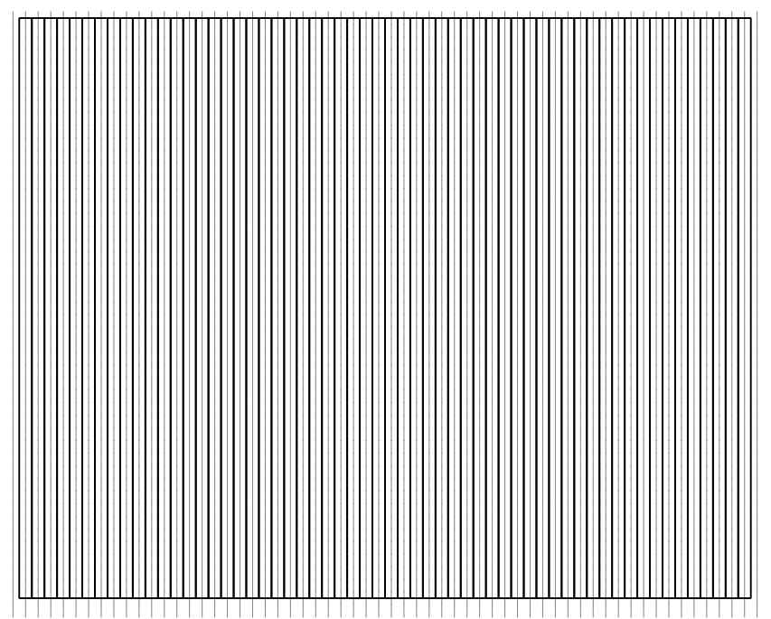
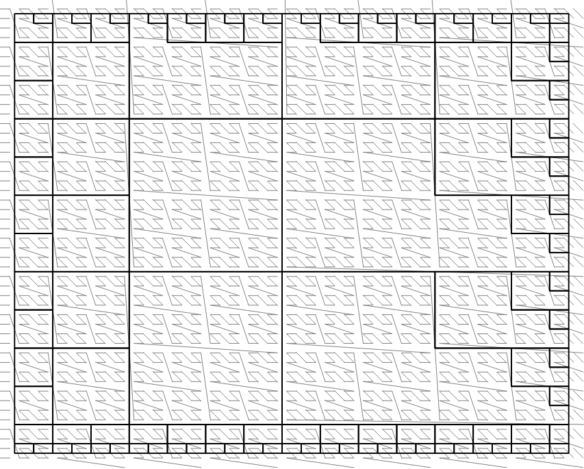
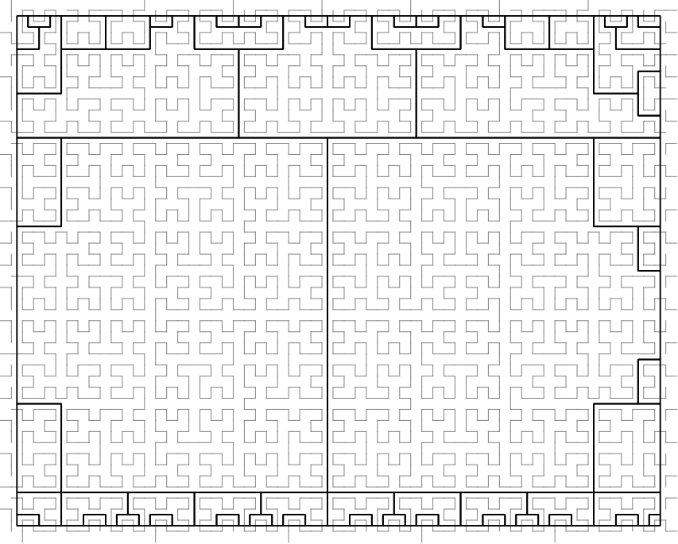
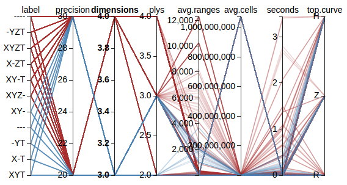
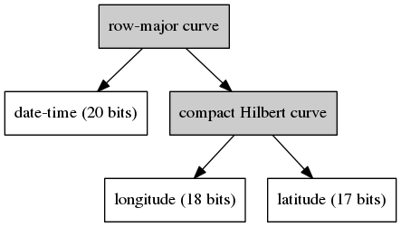

# Space-Filling Curves in Scala

This began as a pure-Scala implementation of the Compact Hilbert Curve,
but is growing into a project that demonstrates how space-filling curves
for NoSQL indexing can be abstracted, and specifically how their ability
to be composed can provide indexing advantages over horizontal dimension
agglomeration.

What does that mean?

## Main idea

Space-filling curve libraries are not novel.  What becomes somewhat more 
interesting is providing a common framework for them to be used in indexing
and query-planning for NoSQL databases such as HBase or Accumulo.
See the [GeoMesa paper](http://www.geomesa.org/assets/outreach/SpatioTemporalIndexing_IEEEcopyright.pdf)
for one example of how this is done in practice for a configurable
space-filling curve built by interleaving components of Geohash with 
components of the lexicographic expression of date-time.  (Full
disclosure:  I am a contributor to the [GeoMesa](http://github.com/locationtech/geomesa) project.)

Rather than weld the specifics of dimensionality to the curve, though, this library
seeks to enforce a different separation of concerns:  A <code>Dimension</code> is
responsible for mapping an input value in user-space to the discrete bucket to which
it belongs; the <code>SpaceFillingCurve</code> implementations accept these bucket
indicators -- ordinal numbers -- and combine them into a new ordinal number that
corresponds to the "knot" on the one-dimensional curve that wends its way through
the higher-dimensional space.

For example, a traditional Geohash works directly on longitude and latitude
values to compute the SFC's index value.  In this library, in contrast, a
dimension is responsible for resolving the latitude to a range-bucket,
resolving the longitude to a range-bucket, and then passing those two ordinal
numbers to the <code>ZCurve</code> to get a single index value back.

A rather pressing question is:  Why bother?

For the cases where you only need a single space-filling curve, there is, in
fact, very little point to introducing a partitioner for the input dimensions.
But...  As most of this work with space-filling curves is done to facilitate
storage and retrieval time in NoSQL databases where the only available index
acts on the lexicographic ordering of entries, then it becomes tricky to
think about how best to incorporate more than two dimensions at a time.  As soon as
you have a 2D geo-spatial index, someone will want to add time; when you have
that 3D index created, someone will want to add altitude; once you have a 4D
index, some other attribute in your record will need to be incorporated, and
this brings us to the subject of...

### Index growth (dimensionality)

As new dimensions need to be indexed, there are two obvious ways this might
be done:  horizontally and vertically.  (And, of course, there are choices
between those two extremes, if you have enough dimensions in the top-level
curve.)

#### Horizontal index growth

The space-filling curves operate on spaces that contain an arbitrary number
of dimensions.  Geohashing is a 2D Z-curve.  GeoMesa uses a (kind of)
3D Z-curve.  You could easily have a 200-dimension Z-curve or Compact Hilbert
curve, or {insert your favorite curve name here} curve.  As you add dimensions
to a single curve, you are essentially growing the index function horizontally.
Think about it like this (where "SFC" is some generic space-filling curve):

1.  2-D is SFC(longitude, latitude) -> index
1.  3-D is SFC(longitude, latitude, date time) -> index
1.  4-D is SFC(longitude, latitude, date time, altitude) -> index
1.  n-D is SFC(d1, d1, ..., dn) -> index

All of the dimensions are added together to the multi-dimensional
space through which a single curve passes.

The point is this:  If you index an N-dimensional space, you had best be
prepared to query by most (if not all) of those N dimensions.  As you
query by fewer than N dimensions, you waste more and more query-planner
time, because it becomes increasingly time-consuming to identify the large
portions of the space that you don't care about.

#### Vertical index growth

Think what it might be like if we didn't cram all of our dimensions into
a single indexed space (directly).  Instead, tier the space-filling curves
like this:

1.  2D is CompactHilbert(longitude, latitude) -> index_1
1.  3-D is Row-major(index_1, date time) -> index_2
1.  4-D is Row-major(index_2, altitude) -> index_3
1.  n-D is Row-major(index_{n-2}, d_n) -> index_{n-1}

You will note that this nesting is really just function composition:  Lower-order
curves are incorporated into higher-order curves as a single new dimension.
The fancy, sinuous curves are only used to merge any two dimensions that ought
to be treated as a single query-entity (often, this really just means, "geometry");
all of the other dimensions that are stacked on are stacked using a row-major
curve that facilitates range queries directly.  Because all of the space-filling
curves are invertible, the n-dimensional index allows you to peel the onion all
the way back through all of the partitions that participated without any loss
of data.  New dimensions stack vertically, in that they are enclose the old index
in a new index function, expediting retrieval.

*This* is why the <code>Dimension</code> is separate from the <code>SpaceFillingCurve</code>.
The curves should not care about dimensions; they should operate on ordinal
values.  The partitioners should worry about dimensions, but they should only
do so when it makes sense.

#### Numbers contrasting various curve stackings

Here are some preliminary numbers for fun:

| curve | num. ranges | query time (sec) |
|-------|-------------|------------------|
|R(R(C(X,Y),Z),T)|3489.76|0.541|
|C(C(X,Y),C(Z,T))|1265.46|7.308|
|R(C(X,Y),C(Z,T))|1777.69|0.268|
|Z(C(X,Y),C(Z,T))|2108.99|1.129|
|C(X,Y,Z,T)|1358.74|5.397|
|R(X,Y,Z,T)|3489.76|0.512|
|Z(X,Y,Z,T)|3595.50|1.156|

Here, "C", "Z", and "R" stand for curves (compact hilbert, Z-order, and row-major)
when used as a function name, and "X", "Y", "Z", and "T" are dimensions (longitude,
latitude, altitude, and date-time).

These tests were run using 11 bits for each of the dimensions, for a total of 44 bits
of data for each of the composite variants.  There was a battery of 100 test queries
that was applied to each of these curves.  Across all 100 test queries, all curves
agreed in identifying an average of 6,551.54 cells per range-set.

The general observations to make are these:

1.  For query times:  R < Z < C.  This is intuitive, in that the response
    time is in inverse proportion to the amount of computation being done.
1.  For the number of contiguous ranges returned:  C < Z < R.  This is a
    direct result of the locality within each of these curves.

It should be no surprise that these two trends work against each other,
although it is interesting to note some of the differences that arise in the
few compositions selected for these tests.

NB:  The query-range planner is shared between the Z-order and Hilbert curves, but
is much faster for the Z-order curve than it is for the Hilbert curve, primarily
because the current implementation of Hilbert could stand some tweaking, being
largely a first-draft translation of the algorithms described in the Hamilton papers.

#### Visual examples of delivered query ranges

Given a bounding box that surrounds Charlotesville, VA, three simple 2D curves --
row-major, Z-order, and Hilbert -- 
were all asked to identify their index ranges that would cover the entire query.  Each
contiguous index range is drawn separately, with the color roughly
proportional to how many cells are contained in the contiguous range.

&nbsp;
&nbsp;


Again, most of what this shows is what was summarized in the preceding section:
Hilbert does a better job of capturing larger, contiguous ranges, whereas it
becomes simple to see why the row-major curve is a faster planner.

#### Data exploration

A single, good visualization of test data is difficult.  Instead, it
sometimes is useful to offer an interactive visualization.  Parallel
corodinates are one such option.  Below is a static image showing a
small rendering of a subset of SFC evaluation data:

<a target="_blank" style="outline:none; border:0;" href="http://www.eichelberger.org/sfseize/parcoords/composite-parcoord.html">
    
</a>

Click on the image to bring up a new tab that contains the fully
interactive version of the chart, using a relatively small subset of
test data.

#### Specific questions to be considered

The test bed is in development to allow us to collect data on these
specific questions (all of which assume *n* dimensions total):

1.  timing:  How quickly can query-ranges be computed for the
    various curves and their compositions?  How does this vary
    with the allocation of total precision among dimensions?
1.  range explosion:  If you start with a query that consists of
    *n* ranges, how many ranges does the top-level curve need to
    emit?  (For all but trivial queries, this number will be larger
    than *n*; the question is, how much larger? and what does the
    size of that increase depend upon?)
1.  "select *" penalties:  planning works best when queries use
    all of the dimensions (when no dimensions default to "select *").
    What is the penalty of leaving one (or more) dimensions out of
    a query, both in terms of time and number of ranges, etc.?
1.  recommendation:  Is it possible to find a set of constraining
    properties such that those properties can be mapped to specific
    recommendations for curve stacking and precision allocation?
    What are the limits of such a recommendation?
1.  geography:  What is the best way to incorporate real-world
    (latitutde, longitude) geometries into an index?  How much
    effort do increasing levels of fidelity cost?  What about
    handling non-point geometries?
1.  planning heuristics:  Depending on the NoSQL database you are
    using, there may be various trade-offs between the client-time
    effort spent planning a query vs. the server-side time spent
    filtering out entries.  Is there a sensible way to accept
    cost hints so that these trade-offs can be balanced within the
    curve portion of a query planner?  If so, how?
1.  interactions:  How to the preceding complexities interact?
    Does, for example, the planning time scale linearly with the number of
    query ranges?

There are plenty more questions; this is simply the list that
occurs to us first.  There's never any shortage of questions...

## Curves included in this library

These are the space-filling curves that have already been encoded:

1.  row-major:  This is a naive curve roughly equivalent to row-major ordering.
1.  z-order:  This curve interleaves bits of the input ordinal numbers.  Oftentimes,
    the precisions are kept all within one bit of each other, but we have relaxed this
    requirement to allow for arbitrary curve composition.
    [Geohashing](http://www.geohash.org) interleaves longitude and latitude ordinals via a z-order
    curve, so the implementation here should be considered a superset of that type of mapping.
1.  compact-hilbert:  Based on a "U"-shape path that recurses (while rotating, flipping), a
    Hilbert curve tends to have fewer, shorter discontinuities in the index-space than the z-order
    curve.  The "compact" refers to the fact that not all dimensions need share the same precision,
    which here we use to support (again) the arbitrary composition of curves.

## Getting started

Before you get started, there's one bit of nomenclature to cover:
As far as this library is concerned, "raw curve" refers to a space-filling
curve that operates strictly in index space; that is, it knows nothing
about the user-space dimensions you might care about, and works strictly
in ordinal numbers both for input and output.  A "composed curve", in
contrast, is a composition of raw curves with <code>Dimension</code>
leaf nodes.  The Geohash example is a composed curve, because it knows
about latitude and longitude, which are real-valued dimensions that can
be discretized as inputs to raw curves.

That behind us, there are a few different ways you can start playing with the library,
listed here from simplest to most involved:

1.  use the Geohash example class;
1.  instantiate some of the raw curves
1.  compose some of your own curves with dimensions

Each of these use cases is presented here in greater detail, but note
that they all exist in the code base in the <code>org.eichelberger.sfc.examples.quickstart</code>
package as <code>Example1.scala</code>, <code>Example2.scala</code>, and <code>Example3.scala</code>, 
respectively.

### Use the Geohash example class

The examples package includes a Geohash implementation.  Although this
is primarily present for reference, it is fully functional.  Here is an
example Scala snippet:

```scala
import org.eichelberger.sfc.examples.Geohash

// create the curve
val totalPrecision = 35  // bits to be allocated between longitude and latitude
val geohash = new Geohash(totalPrecision)

// compute a hash from a (lon, lat) point
val hashCville = geohash.pointToHash(Seq(-78.49, 38.04))
println(s"Representative Charlottesville point hashes to $hashCville")

// compute the (inverse) cell from the hash
val cellCville = geohash.hashToCell(hashCville)
println(s"Representative Charlottesville hash corresponds to cell $cellCville")
```

If all you want to do is to use Geohash strings to map between physical
(lon, lat) points and Geohash cells, that's all there is to it.

NB:  "Proper" Geohash strings use a base-32 alphabet, which this lexicoder will
only use when the total precision is evenly divisible by 5.  If you use a total
precision like 19, your hash will be expressed using base-2 characters.
Easy enough, once you know.  

### Instantiate some of the raw curves

The raw curves operate strictly on ordinal numbers, because they map between
index spaces, and ignore user space entirely.  This makes them somewhat more
abstract than the Geohash example listed previously.

Also unlike the Geohash example, the raw curves are valid for arbitrarily 
many dimensions, so you have to specify the precision of each of the dimensions
explicitly.  For example:

```scala
import org.eichelberger.sfc._
import org.eichelberger.sfc.SpaceFillingCurve._

// create a 4D curve
val zCurve = new ZCurve(OrdinalVector(10, 20, 15, 4))

// map from an input point to a hashed point
val idx = zCurve.index(OrdinalVector(7, 28, 2001, 8))
println(s"(7, 28, 2001, 8) -> $idx")

// invert the map back to inputs
val point = zCurve.inverseIndex(idx)
println(s"$idx <- $point")
```

That snipped creates a four-dimensional Z-Order curve in which
the dimensions contain 1,024, 1,048,576, 32,768, and 16 cells,
respectively.  (This is perfectly valid for a Z-Order curve,
although their use in Geohashes often sees them used with precisions
that are all within 1 bit of each other.)

The curve must be able to go from an initial input to a hash back
to the initial input *without any loss of information*, because
the operations occur strictly within index space.  Without this
property, composition becomes fruitless (or at least much, *much*
more complicated).

### Compose your own curves with dimensions

First, congratulations for having read this far, even if all you
did was scroll down from the top.  Documentation is even more
tiring to read than it is to write...

Composing your own curve consists of two main phases:  Deciding
what user-space variables you care about (including how to bin them),
and establishing your functional chain of raw curves on top of
those dimensions.

As our example, assume we wanted to build a curve in which plain
(lon, lat) geography was joined in a Hilbert curve, and that curve's
output was joined with date-time in a row-major curve.  This composition
is illustrated below.



Here is a code snippet that would construct, and use, this curve:

```scala
  import org.eichelberger.sfc._
  import org.eichelberger.sfc.Dimensions._
  import org.eichelberger.sfc.SpaceFillingCurve._
  import org.joda.time.{DateTimeZone, DateTime}

  // create the dimensions that can manage user-space
  val x = DefaultDimensions.createLongitude(18)  // ~153 meters per cell (@ equator)
  val y = DefaultDimensions.createLatitude(17)   // ~153 meters per cell
  val t = DefaultDimensions.createDateTime(
      new DateTime(1970, 1, 1, 0, 0, 0, DateTimeZone.forID("UTC")),
      new DateTime(2010, 12, 31, 23, 59, 59, DateTimeZone.forID("UTC")),
      20
    )

  // compose the curve with dimensions
  val curve = new ComposedCurve(
    RowMajorCurve(20, 35),
    Seq(
      t,
      new ComposedCurve(
        CompactHilbertCurve(18, 17),
        Seq(x, y)
      )
    )
  )

  // hashing points in user space
  val point = Seq(
    new DateTime(1998, 4, 7, 21, 15, 11, DateTimeZone.forID("UTC")),  // t
    -78.49,                                                           // x
    38.04                                                             // y
  )
  val hash = curve.pointToHash(point)
  println(s"$point -> $hash")

  // fetching user-space cells from hash value
  val cell = curve.hashToCell(hash)
  println(s"$cell <- $hash")

  // identify the top-level index-ranges that cover a query
  val query = Cell(Seq(
    DefaultDimensions.createDateTime(
      new DateTime(1998, 6, 15, 0, 0, 0, DateTimeZone.forID("UTC")),
      new DateTime(1998, 7, 15, 23, 59, 59, DateTimeZone.forID("UTC")),
      0
    ),
    DefaultDimensions.createDimension("x", -80.0, -79.0, 0),
    DefaultDimensions.createDimension("y", 38.0, 39.0, 0)
  ))
  val ranges = curve.getRangesCoveringCell(query).toList
  println(s"Number of ranges:  ${ranges.size}")
  val totalCells = ranges.map(_.size).sum
  println(s"Total cells in ranges:  $totalCells")
```

For illustration, we have constructed a time dimension that is only 
defined over the span January 1, 1970 through December 31, 2010.
At 20 bits, this makes each of the 1,048,576 bins approximately
1,233,901 milliseconds (20 minutes and 33.9 seconds days) wide.

The query we show uses a time-range of approximately one month and a geographic
range of 1 degree longitude by 1 degree latitude.  Because the total
precision of the composed curve is 55 bits, this query covers
more than 1.15 billion cells contained in 1.76 million ranges.
Whether the time required to enumerate these ranges is acceptable
depends upon your application.

NB:  The order matters *very much* when composing these curves.
The entire reason that the date-time dimension is on the left is
that, for date-only queries, computing the query ranges would be
very fast; if we were more likely to have geometry-only queries,
then the Hilbert curve joining longitude and latitude should have
been placed on the left (the "major" position in the row-major curve).

## "Wouldn't it be cool..."

Here are some tasks that would be fun to incorporate:

1.  Move SFC index encoding and decoding into the GPU.  Most of these computations
    are fairly simple bit-twiddling exercises.
    
1.  Expand the test suite and benchmarking.  Tie this into the project documentation.

1.  ... {insert your ideas here} ...

## Other resources

Papers concerning the compact Hilbert curve:

1.  Hamilton, C. H., Rau-Chaplin, A.
    "Compact Hilbert Indices for Multi-Dimensional Data".
    In Proceedings of the First International Conference on Complex, Intelligent and Software Intensive Systems
    published by the IEEE.  2007.
    [PDF](https://web.cs.dal.ca/~arc/publications/2-43/paper.pdf)
    
    1.  This contains the meat of the indexing algorithm used here, but does not contain the inverse.  
    
1.  C. Hamilton.  Compact Hilbert indices.  "Technical Report C-2006-07".
    Dalhousie University, Faculty of Computer Science, July 2006.
    [PDF](https://www.cs.dal.ca/sites/default/files/technical_reports/CS-2006-07.pdf)
    
    1.  This describes both the indexing method and the inverse index, but uses a slightly different
        form than the follow-up paper.

Other projects that may be of interest:

1.  the relatively new space-filling curve project ([code](https://github.com/geotrellis/curve.git), 
    [description](http://www.locationtech.org/proposals/sfcurve)) at LocationTech
1.  the [Uzaygezen](https://code.google.com/p/uzaygezen/) Java-based compact-Hilbert curve implementation
