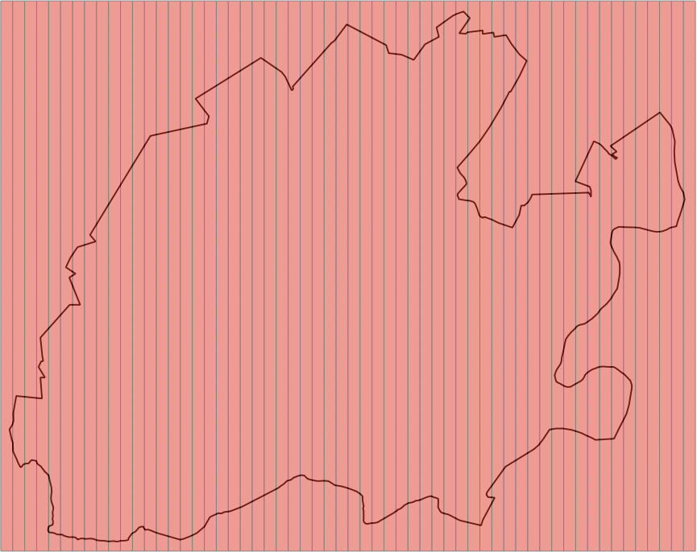
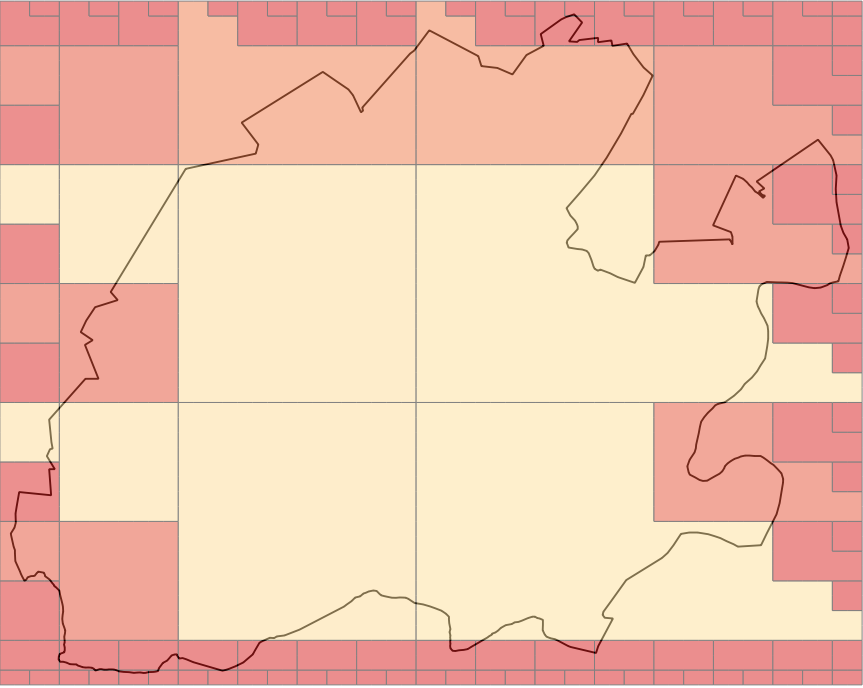
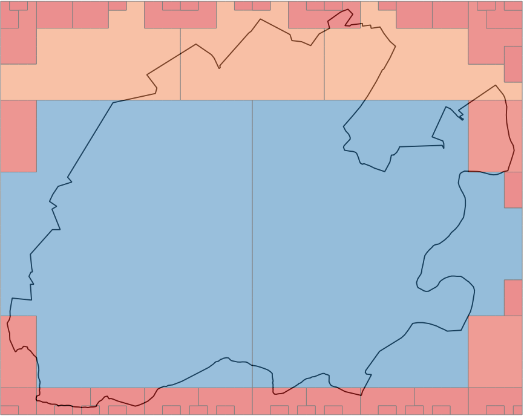

# Space-Filling Curves in Scala

This began as a pure-Scala implementation of the Compact Hilbert Curve,
but is growing into a project that demonstrates how space-filling curves
for NoSQL indexing can be abstracted, and specifically how their ability
to be composed can provide indexing advantages over horizontal dimension
agglomeration.

What does that mean?

## Main idea

Space-filling curve libraries are not novel.  What becomes somewhat more 
interesting is providing a common framework for them to be used in indexing
and query-planning for NoSQL databases such as HBase or Accumulo.
See the [GeoMesa paper](http://www.geomesa.org/assets/outreach/SpatioTemporalIndexing_IEEEcopyright.pdf)
for one example of how this is done in practice for a configurable
space-filling curve built by interleaving components of Geohash with 
components of the lexicographic expression of date-time.  (Full
disclosure:  I am a contributor to the [GeoMesa](http://github.com/locationtech/geomesa) project.)

Rather than weld the specifics of dimensionality to the curve, though, this library
seeks to enforce a different separation of concerns:  A <code>Dimension</code> is
responsible for mapping an input value in user-space to the discrete bucket to which
it belongs; the <code>SpaceFillingCurve</code> implementations accept these bucket
indicators -- ordinal numbers -- and combine them into a new ordinal number that
corresponds to the "knot" on the one-dimensional curve that wends its way through
the higher-dimensional space.

For example, a traditional Geohash works directly on longitude and latitude
values to compute the SFC's index value.  In this library, in contrast, a
dimension is responsible for resolving the latitude to a range-bucket,
resolving the longitude to a range-bucket, and then passing those two ordinal
numbers to the <code>ZCurve</code> to get a single index value back.

A rather pressing question is:  Why bother?

For the cases where you only need a single space-filling curve, there is, in
fact, very little point to introducing a partitioner for the input dimensions.
But...  As most of this work with space-filling curves is done to facilitate
storage and retrieval time in NoSQL databases where the only available index
acts on the lexicographic ordering of entries, then it becomes tricky to
think about how best to incorporate more than two dimensions at a time.  As soon as
you have a 2D geo-spatial index, someone will want to add time; when you have
that 3D index created, someone will want to add altitude; once you have a 4D
index, some other attribute in your record will need to be incorporated, and
this brings us to the subject of...

### Index growth (dimensionality)

As new dimensions need to be indexed, there are two obvious ways this might
be done:  horizontally and vertically.

#### Horizontal index growth

The space-filling curves operate on spaces that contain an arbitrary number
of dimensions.  Geohashing is a 2D Z-curve.  GeoMesa uses a (kind of)
3D Z-curve.  You could easily have a 200-dimension Z-curve or Compact Hilbert
curve, or {insert your favorite curve name here} curve.  As you add dimensions
to a single curve, you are essentially growing the index function horizontally.
Think about it like this (where "SFC" is some generic space-filling curve):

1.  2-D is SFC(longitude, latitude) -> index
1.  3-D is SFC(longitude, latitude, date time) -> index
1.  4-D is SFC(longitude, latitude, date time, altitude) -> index
1.  n-D is SFC(d1, d1, ..., dn) -> index

All of the dimensions are added together to the multi-dimensional
space through which a single curve passes.

The point is this:  If you index an N-dimensional space, you had best be
prepared to query by most (if not all) of those N dimensions.  As you
query by fewer than N dimensions, you waste more and more query-planner
time, because it becomes increasingly time-consuming to identify the large
portions of the space that you don't care about.

#### Vertical index growth

Think what it might be like if we didn't cram all of our dimensions into
a single indexed space (directly).  Instead, tier the space-filling curves
like this:

1.  2D is CompactHilbert(longitude, latitude) -> index_1
1.  3-D is Rectilinear(index_1, date time) -> index_2
1.  4-D is Rectilinear(index_2, altitude) -> index_3
1.  n-D is Rectilinear(index_{n-2}, d_n) -> index_{n-1}

You will note that this nesting is really just function composition:  Lower-order
curves are incorporated into higher-order curves as a single new dimension.
The fancy, sinuous curves are only used to merge any two dimensions that ought
to be treated as a single query-entity (often, this really just means, "geometry");
all of the other dimensions that are stacked on are stacked using a rectilinear
curve that facilitates range queries directly.  Because all of the space-filling
curves are invertible, the n-dimensional index allows you to peel the onion all
the way back through all of the partitions that participated without any loss
of data.  New dimensions stack vertically, in that they are enclose the old index
in a new index function, expediting retrieval.

*This* is why the <code>Dimension</code> is separate from the <code>SpaceFillingCurve</code>.
The curves should not care about dimensions; they should operate on ordinal
values.  The partitioners should worry about dimensions, but they should only
do so when it makes sense.

#### Numbers contrasting various curve stackings

Here are some preliminary numbers for fun:

| curve | num. ranges | query time (sec) |
|-------|-------------|------------------|
|R(R(C(X,Y),Z),T)|3489.76|0.541|
|C(C(X,Y),C(Z,T))|1265.46|7.308|
|R(C(X,Y),C(Z,T))|1777.69|0.268|
|Z(C(X,Y),C(Z,T))|2108.99|1.129|
|C(X,Y,Z,T)|1358.74|5.397|
|R(X,Y,Z,T)|3489.76|0.512|
|Z(X,Y,Z,T)|3595.50|1.156|

Here, "C", "Z", and "R" stand for curves (compact hilbert, Z-order, and rectilinear)
when used as a function name, and "X", "Y", "Z", and "T" are dimensions (longitude,
latitude, altitude, and date-time).

These tests were run using 11 bits for each of the dimensions, for a total of 44 bits
of data for each of the composite variants.  There was a battery of 100 test queries
that was applied to each of these curves.  Across all 100 test queries, all curves
agreed in identifying an average of 6,551.54 cells per range-set.

The general observations to make are these:

1.  For query times:  R < Z < C.  This is intuitive, in that the response
    time is in inverse proportion to the amount of computation being done.
1.  For the number of contiguous ranges returned:  C < Z < R.  This is a
    direct result of the locality within each of these curves.

It should be no surprise that these two trends work against each other,
although it is interesting to note some of the differences that arise in the
few compositions selected for these tests.

NB:  The query-range planner is shared between the Z-order and Hilbert curves, but
is much faster for the Z-order curve than it is for the Hilbert curve, primarily
because the current implementation of Hilbert could stand some tweaking, being
largely a first-draft translation of the algorithms described in the Hamilton papers.

#### Visual examples of delivered query ranges

Given a bounding box that surrounds Charlotesville, VA, three simple 2D curves --
rectilinear, Z-order, and Hilbert -- 
were all asked to identify their index ranges that would cover the entire query.  Each
contiguous index range is drawn separately, with the color roughly
proportional to how many cells are contained in the contiguous range.

&nbsp;
&nbsp;

Again, most of what this shows is what was summarized in the preceding section:
Hilbert does a better job of capturing larger, contiguous ranges, whereas it
becomes simple to see why the rectilinear curve is a faster planner.

## Curves included in this library

These are the space-filling curves that have already been encoded:

1.  rectilinear:  This is a naive curve roughly equivalent to row-major ordering.
1.  z-order:  This curve interleaves bits of the input ordinal numbers, which means that not all
    combinations of input precisions are valid.  For example, having a two-dimensional space in
    which the first dimension uses 10 bits and the second uses 2 bits is not a good fit for a
    z-order mapping.  (There are ways to overcome this, but for now it just complains.)
    [Geohashing](http://www.geohash.org) interleaves longitude and latitude ordinals via a z-order
    curve, so the implementation here should be considered a superset of that type of mapping.
1.  compact-hilbert:  Based on a "U"-shape path that recurses (while rotating, flipping), a
    Hilbert curve tends to have fewer, shorter discontinuities in the index-space than the z-order
    curve.  The "compact" refers to the fact that not all dimensions need share the same precision.

## "Wouldn't it be cool..."

Here are some tasks that would be fun to incorporate:

1.  Move SFC index encoding and decoding into the GPU.  Most of these computations
    are fairly simple bit-twiddling exercises.
    
1.  Expand the test suite and benchmarking.  Tie this into the project documentation.

1.  ... {insert your ideas here} ...

## Other resources

Papers concerning the compact Hilbert curve:

1.  Hamilton, C. H., Rau-Chaplin, A.
    "Compact Hilbert Indices for Multi-Dimensional Data".
    In Proceedings of the First International Conference on Complex, Intelligent and Software Intensive Systems
    published by the IEEE.  2007.
    [PDF](https://web.cs.dal.ca/~arc/publications/2-43/paper.pdf)
    
    1.  This contains the meat of the indexing algorithm used here, but does not contain the inverse.  
    
1.  C. Hamilton.  Compact Hilbert indices.  "Technical Report C-2006-07".
    Dalhousie University, Faculty of Computer Science, July 2006.
    [PDF](https://www.cs.dal.ca/sites/default/files/technical_reports/CS-2006-07.pdf)
    
    1.  This describes both the indexing method and the inverse index, but uses a slightly different
        form than the follow-up paper.

Other projects that may be of interest:

1.  the relatively new space-filling curve project ([code](https://github.com/geotrellis/curve.git), 
    [description](http://www.locationtech.org/proposals/sfcurve)) at LocationTech
1.  the [Uzaygezen](https://code.google.com/p/uzaygezen/) Java-based compact-Hilbert curve implementation
